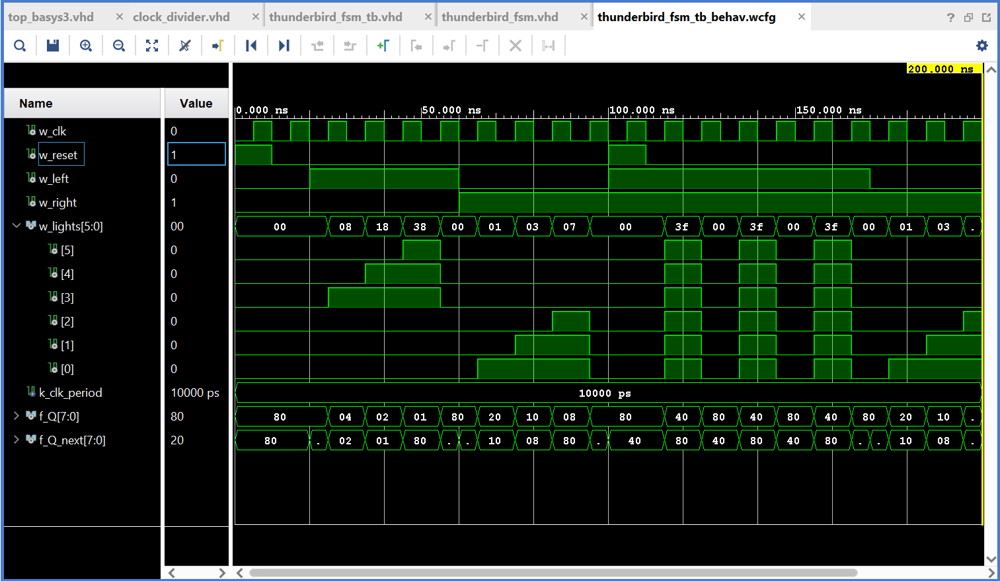
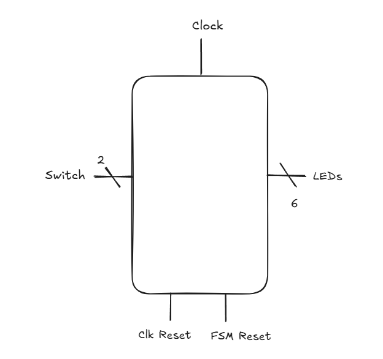

# Lab 3: Thunderbird Turn Signal

VHDL for ECE 281 [Lab 3](https://usafa-ece.github.io/ece281-book/lab/lab3.html)

Targeted toward Digilent Basys3. Make sure to install the [board files](https://github.com/Xilinx/XilinxBoardStore/tree/2018.2/boards/Digilent/basys3).

Built for Vivado 2024.2 on Windows 11.

# Sharepoint Link to Lab 3 Report
https://usafa0-my.sharepoint.com/:w:/g/personal/c28benedict_zito_afacademy_af_edu/IQBEBTGLcwAVTaOH3dAsEMF-AXRWeJ6-p5vG1h9HFHHmp7g?e=WUsVQs